```mermaid
graph TD
    A[🎯 Current Skills] --> B[MERN Stack Mastery]
    A --> C[AI/ML Integration]
    A --> D[Mobile Development]
    
    B --> E[Advanced React Patterns]
    B --> F[Node.js Optimization]
    B --> G[Database Design]
    
    C --> H[TensorFlow.js]
    C --> I[Computer Vision]
    C --> J[NLP Applications]
    
    D --> K[React Native]
    D --> L[Flutter Advanced]
    D --> M[App Store Deployment]
    
    E --> N[🚀 Production Ready]
    F --> N
    G --> N
    H --> O[🤖 AI-Powered Apps]
    I --> O
    J --> O
    K --> P[📱 Cross-Platform Expert]
    L --> P
    M --> P
```

<div align="center">
  
</div>

<div align="center">
  
</div>

<div align="center">
  
</div>

<div align="center">
  
  
  
</div>

---

##  **About Me - The Code Architect**

```typescript
interface Developer {
  name: string;
  role: string;
  location: string;
  languages: string[];
  currentProjects: string[];
  goals2024: string[];
  funFact: string;
}

const Heramb: Developer = {
  name: "Heramb Daghale",
  role: "Full Stack Developer & AI Enthusiast",
  location: "India 🇮🇳",
  languages: ["JavaScript", "TypeScript", "Python", "Java", "C++"],
  currentProjects: [
    "🏛️ Autonomy Result Declaration System",
    "📊 Trading Professional Dashboard",
    "🤖 AI/ML Integration Projects"
  ],
  goals2024: [
    "Master MERN Stack",
    "Deploy 10+ Production Apps",
    "Contribute to Open Source",
    "Build AI-Powered Solutions"
  ],
  funFact: "I can debug code for hours... but forget to charge my laptop! 🔋⚡"
};
```

<div align="center">
  
</div>

---

##  **Tech Arsenal**

<div align="center">

### 🚀 **Programming Languages**


### 🎨 **Frontend Technologies**


### ⚙️ **Backend & Database**


### 📱 **Mobile Development**


### 🛠️ **DevOps & Tools**


### 🤖 **AI/ML & Data Science**


</div>

<div align="center">
  
</div>

---

##  **GitHub Analytics Dashboard**

<div align="center">
  
  
</div>

<div align="center">
  
</div>

<div align="center">
  
</div>

---

##  **Project Showcase**

<div align="center">

| 🎯 **Current Focus** | 🚀 **Upcoming Projects** |
|:---:|:---:|
|  | **Trading Dashboard Pro** 📊<br/>*React + Node.js + WebSocket* |
| **Autonomy Result Declaration** 🏛️<br/>*MERN Stack + Authentication* | **AI Code Assistant** 🤖<br/>*Python + OpenAI + Flask* |
| **MERN E-Commerce Platform** 🛒<br/>*Full Stack with Payment Gateway* | **Mobile App Portfolio** 📱<br/>*React Native + Firebase* |

</div>

---

##  **Contribution Heatmap**

<div align="center">
  
</div>

---

##  **Achievement Unlocked**

<div align="center">
  
</div>

<div align="center">
  
### 🏆 **Coding Stats**
  


</div>

---

##  **Learning Journey 2024**

<div align="center">



</div>

---

##  **Connect & Collaborate**

<div align="center">

### 🌐 **Find Me Across The Web**

[](https://linkedin.com/in/heramb%20daghale)
[](https://instagram.com/_heramb_04)
[](https://www.leetcode.com/heramb04)
[](mailto:herambdaghale@gmail.com)
[](https://github.com/Heramb004)
[](https://drive.google.com/file/d/138ca2y9Jrf3SetUeikROgcxdrkbemMaf/view?usp=sharing)

### 💬 **Let's Talk About**
`Frontend Development` • `Backend Architecture` • `AI Integration` • `Mobile Apps` • `Open Source` • `Tech Innovations`

</div>

---

##  **Daily Motivation**

<div align="center">
  
</div>

---

##  **2024 Mission Control**

<div align="center">

### 🎯 **Goals & Milestones**

| Goal | Progress | Target Date |
|:---:|:---:|:---:|
| 🚀 Master MERN Stack | ████████░░ 80% | Q2 2024 |
| 🤖 AI/ML Integration | ██████░░░░ 60% | Q3 2024 |
| 📱 Mobile App Launch | ████░░░░░░ 40% | Q4 2024 |
| 🏆 Open Source Contrib | ██░░░░░░░░ 20% | Ongoing |
| 📊 Trading Dashboard | ████████░░ 80% | Q2 2024 |

### 📈 **This Week's Focus**
```yaml
Monday: React Advanced Patterns
Tuesday: Node.js Performance Optimization
Wednesday: Database Architecture
Thursday: AI Model Integration
Friday: Code Review & Testing
Weekend: Open Source Contributions
```

</div>

---

##  **GitHub Insights**

<div align="center">
  


### ⚡ **Quick Stats**


</div>

---

##  **Visitor's Guestbook**

<div align="center">
  
[](https://github.com/heramb004/heramb004/issues/new?title=Guestbook%20Entry&body=Thanks%20for%20visiting%20my%20profile!)

*Leave a ⭐ if you found my profile interesting!*

</div>

---

<div align="center">
  
### 🎵 **Currently Vibing To**
[](https://spotify-github-profile.vercel.app/api/view?uid=31l26yvapkj4dswqwwaxpcopc2eq&redirect=true)

</div>

---

##  **Snake Game - Watch My Contributions Get Eaten!**

<div align="center">
  
</div>

---

<div align="center">
  
### 🚀 **The Future is Code**
  
*"In a world full of algorithms, be the one who writes them."*


### 💝 **Thanks for stopping by!**
*Feel free to connect and let's build something amazing together!*


</div>

<div align="center">
  
</div>
